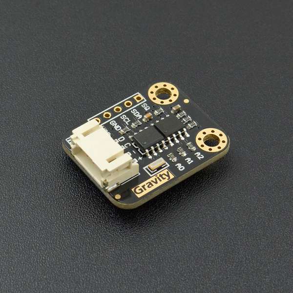

# DFRobot_DS1307
* [中文版](./README_CN.md)

The DS1307 serial real-time clock (RTC) is a low-power, full binary-coded decimal (BCD) clock/calendar 
plus 56 bytes of NV SRAM. Address and data are transferred serially through an I2C, bidirectional bus. 
The clock/calendar provides seconds, minutes, hours, day, date, month, and year information. The end of 
the month date is automatically adjusted for months with fewer than 31 days, including corrections for leap 
year. The clock operates in either the 24-hour or 12-hour format with AM/PM indicator. The DS1307 has a 
built-in power-sense circuit that detects power failures and automatically switches to the backup supply. 
Timekeeping operation continues while the part operates from the backup supply.




## Product Link (https://www.dfrobot.com/product-879.html)
    SKU: DFR0151


## Table of Contents

* [Summary](#summary)
* [Installation](#installation)
* [Methods](#methods)
* [Compatibility](#compatibility)
* [History](#history)
* [Credits](#credits)


## Summary

* Real-Time Clock (RTC) Counts Seconds, Minutes, Hours, Date of the Month, Month, Day of the week, and Year with Leap-Year Compensation Valid Up to 2100
* 56-Byte, Battery-Backed, General-Purpose RAMwith Unlimited Writes
* I2C Serial Interface
* Programmable Square-Wave Output Signal
* Automatic Power-Fail Detect and Switch Circuitry
* Consumes Less than 500nA in Battery-Backup Mode with Oscillator Running
* Optional Industrial Temperature Range:-40°C to +85°C 
* Available in 8-Pin Plastic DIP or SO
* Underwriters Laboratories (UL) Recognized


## Installation

To use the library, first download the library file, paste it into the directory you specified, then open the Examples folder and run the demo in that folder.


## Methods

```python

  '''!
    @brief 初始化函数
    @return  返回初始化状态
    @retval True 表示初始化成功
    @retval False 表示初始化成失败
  '''
  def begin(self):

  '''!
    @brief 从rtc模块获取时间
    @return 获取的时间的列表
    @n rtc[0]为 e_SEC 类型, 范围为: 00-59
    @n rtc[1]为 e_MIN 类型, 范围为: 00-59
    @n rtc[2]为 e_HR 类型, 范围为: 00-23
    @n rtc[3]为 e_DOW 类型, 范围为: 01-07
    @n rtc[4]为 e_DATE 类型, 范围为: 01-31
    @n rtc[5]为 e_MTH 类型, 范围为: 01-12
    @n rtc[6]为 e_YR 类型, 范围为: 2000-2099
  '''
  def get_time(self):

  '''!
    @brief 从rtc模块获取单个类型的时间
    @param type 要获取的时间类型:
    @n e_SEC, e_MIN, e_HR, e_DOW, e_DATE, e_MTH, e_YR
    @return 根据选择的时间类型, 返回对应范围的数值
    @n 读取 e_SEC 类型时, 范围为: 00-59
    @n 读取 e_MIN 类型时, 范围为: 00-59
    @n 读取 e_HR 类型时, 范围为: 00-23
    @n 读取 e_DOW 类型时, 范围为: 01-07
    @n 读取 e_DATE 类型时, 范围为: 01-31
    @n 读取 e_MTH 类型时, 范围为: 01-12
    @n 读取 e_YR 类型时, 范围为: 2000-2099
  '''
  def get_type_time(self, type):

  '''!
    @brief 根据给的数组, 设置所有时间
    @param rtc 按如下格式编辑的数组
    @n rtc[0]为 e_SEC 类型, 范围为: 00-59
    @n rtc[1]为 e_MIN 类型, 范围为: 00-59
    @n rtc[2]为 e_HR 类型, 范围为: 00-23
    @n rtc[3]为 e_DOW 类型, 范围为: 01-07
    @n rtc[4]为 e_DATE 类型, 范围为: 01-31
    @n rtc[5]为 e_MTH 类型, 范围为: 01-12
    @n rtc[6]为 e_YR 类型, 范围为: 2000-2099
    @n 注意: 超出范围的将导致设置错误
  '''
  def set_time(self, rtc):

  '''!
    @brief 根据选择设置的时间类型, 传入对应范围的数值, 设置时间
    @param type 要获取的时间类型:
    @n e_SEC, e_MIN, e_HR, e_DOW, e_DATE, e_MTH, e_YR
    @param type_time 根据选择的时间类型, 写入对应范围的数值
    @n 读取 e_SEC 类型时, 范围为: 00-59
    @n 读取 e_MIN 类型时, 范围为: 00-59
    @n 读取 e_HR 类型时, 范围为: 00-23
    @n 读取 e_DOW 类型时, 范围为: 01-07
    @n 读取 e_DATE 类型时, 范围为: 01-31
    @n 读取 e_MTH 类型时, 范围为: 01-12
    @n 读取 e_YR 类型时, 范围为: 2000-2099
  '''
  def set_type_time(self, type, type_time):

  '''!
    @brief 启动RTC计时功能
    @n this bit is part of the seconds byte
  '''
  @property
  def start(self):

  '''!
    @brief 停止RTC计时功能
    @n this bit is part of the seconds byte
  '''
  @property
  def stop(self):

  '''!
    @brief control the operation of the SQW/OUT pin
    @param mode SQW Pin 输出模式:
    @n e_square_wave_LOW, e_square_wave_HIGH, e_square_wave_1Hz, 
    @n e_square_wave_4kHz, e_square_wave_8kHz, e_square_wave_32kHz
  '''
  def set_SQW_pin_mode(self, mode):

  '''!
    @brief 获取 SQW/OUT pin 当前输出模式
    @return 输出模式:
    @n e_square_wave_LOW, e_square_wave_HIGH, e_square_wave_1Hz, 
    @n e_square_wave_4kHz, e_square_wave_8kHz, e_square_wave_32kHz
  '''
  def get_SQW_pin_mode(self):

  '''!
    @brief 将当前时间存入EEPROM, 可用于掉电重启后, 将时间设置为最后一次保存的时间
    @n 掉电时调用此接口, 重启时调用setTimeFromEEPROM()即可实现
  '''
  @property
  def save_time_to_EEPROM(self):

  '''!
    @brief 将时间设置为最后一次保存的时间
    @n 如果之前没调用过saveTimeToEEPROM(), 或者调用完后自行
    @n 修改了EEPROM里面的内容, 则可能导致时间设置错误
    @note 如果未使传感器掉电时复位主控板, 可能会使该接口误调用, 从而误更改时间
  '''
  @property
  def set_time_from_EEPROM(self):

  '''!
    @brief writes data to a EEPROM
    @param reg EEPROM address
    @param data written data
  '''
  def write_EEPROM(self, reg, data):

  '''!
    @brief read the data from the EEPROM
    @param reg EEPROM address
    @param length read data length
    @return read data list
  '''
  def read_EEPROM(self, reg, length):

```


## Compatibility

* RaspberryPi Version

| Board        | Work Well | Work Wrong | Untested | Remarks |
| ------------ | :-------: | :--------: | :------: | ------- |
| RaspberryPi2 |           |            |    √     |         |
| RaspberryPi3 |           |            |    √     |         |
| RaspberryPi4 |     √     |            |          |         |

* Python Version

| Python  | Work Well | Work Wrong | Untested | Remarks |
| ------- | :-------: | :--------: | :------: | ------- |
| Python2 |     √     |            |          |         |
| Python3 |     √     |            |          |         |


## History

- 2021/12/02 - Version 1.0.0 released.


## Credits

Written by qsjhyy(yihuan.huang@dfrobot.com), 2021. (Welcome to our [website](https://www.dfrobot.com/))

